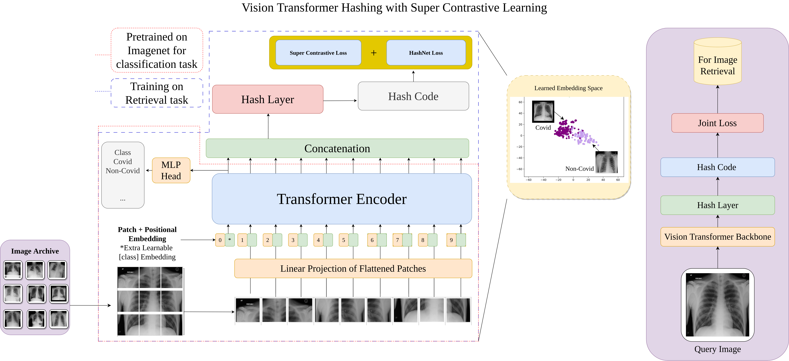
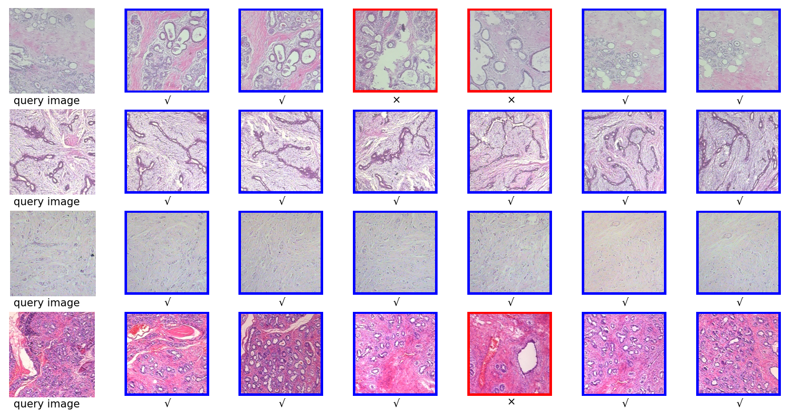
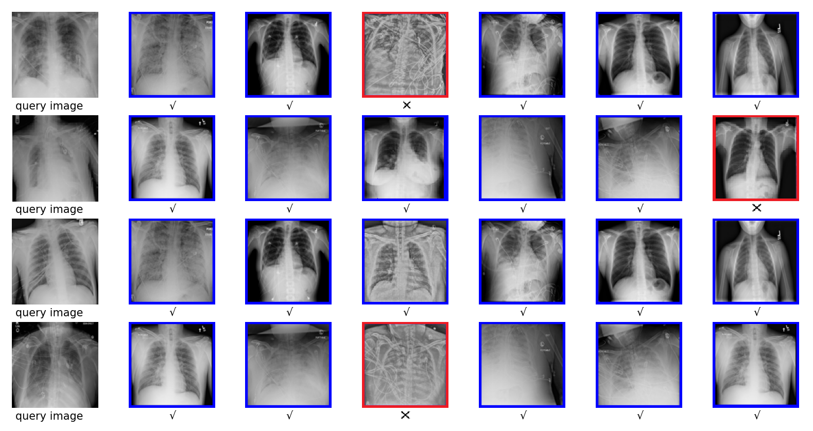

# VTHSC-MIR PRL 2024
VTHSC-MIR: Vision Transformer Hashing with Supervised Contrastive learning based medical image retrieval 
{https://doi.org/10.1016/j.patrec.2024.06.003)

Figure 1: We have developed a framework for image retrieval named Vision Transformer Hashing with Supervised Contrastive Learning. In this framework, the
pre-trained Vision Transformer (ViT Model) is employed for image classification, serving as a surrogate task (indicated by the Red Dotted Line). Subse-
quently, the model undergoes training for the primary retrieval task (illustrated by the Blue Dotted Line). To optimize the model, we employ a joint loss opti-
mization approach, combining the Hashnet Loss and the Supervised Contrastive Loss

## How to Run

This code uses the Vision Transformer (ViT) code and pretrained model (https://github.com/jeonsworld/ViT-pytorch) (https://github.com/shivram1987/VisionTransformerHashing) and DeepHash framework (https://github.com/swuxyj/DeepHash-pytorch).

Download the ViT pretrained models from official repository and keep under pretrainedVIT directory:

ViT-B_16: https://storage.googleapis.com/vit_models/imagenet21k/ViT-B_16.npz 

ViT-B_32: https://storage.googleapis.com/vit_models/imagenet21k/ViT-B_32.npz

Download data from https://github.com/swuxyj/DeepHash-pytorch for different dataset, if not already present under data directory.

## Qualitative results

Figure. 2: Top 6 query retrieval results of BreakHis dataset

 
Figure 3: Top 6 query retrieval results of COVIDx CXR-3 dataset
### Paper Citation
Please cite following paper if you make use of this code in your research:

@article{kumar2024vthsc,
  title={VTHSC-MIR: Vision Transformer Hashing with Supervised Contrastive learning based medical image retrieval},
  author={Kumar, Mehul and Singh, Rhythumwinder and Mukherjee, Prerana},
  journal={Pattern Recognition Letters},
  year={2024},
  publisher={Elsevier}
}
